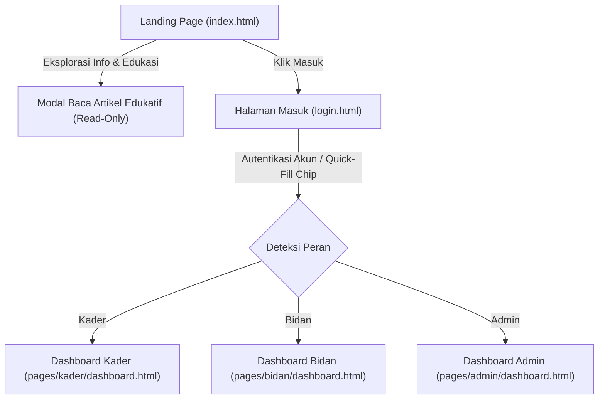
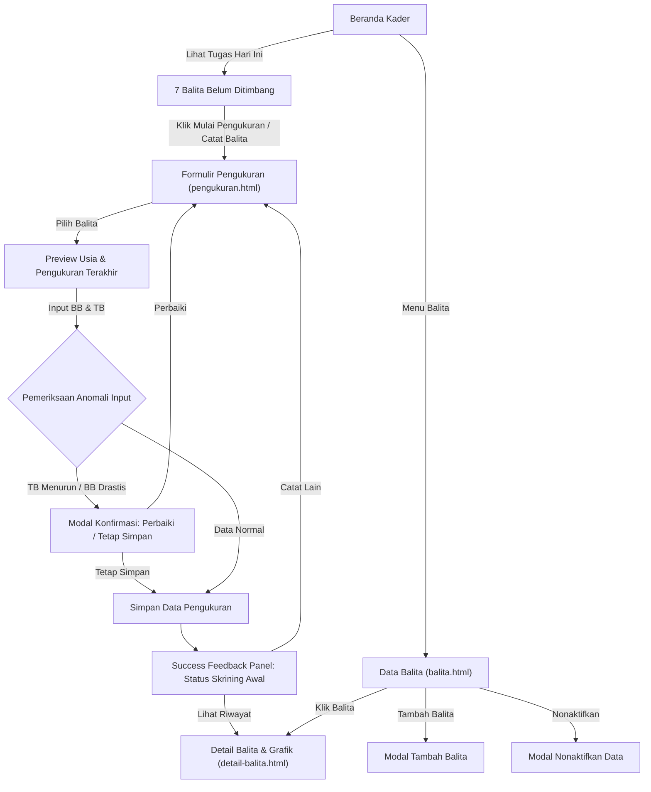
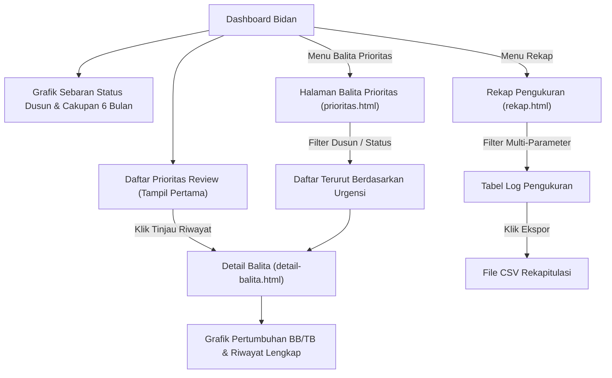
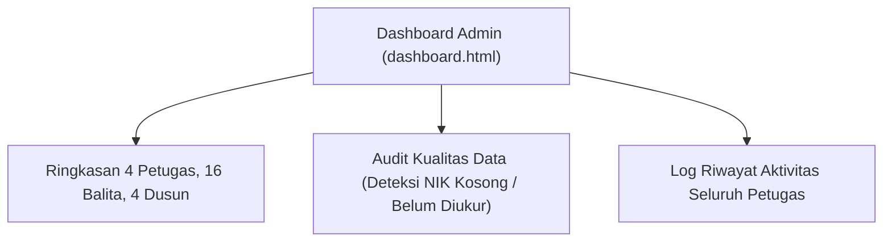

# UI Flow & User Journeys — Posyandu Pintar
## FITCOM 4.0 — Intelligent Home & Community

Dokumen ini memetakan diagram alur antarmuka pengguna untuk Landing Page, Edukasi, serta peran Kader, Bidan, dan Admin Desa.

---

## 1. Alur Masuk & Autentikasi

---

## 2. Alur Pengguna: Kader Posyandu (HP-First)

Pertanyaan Utama: *"Hari ini siapa yang perlu saya catat?"*

---

## 3. Alur Pengguna: Bidan Desa (Decision-First)

Pertanyaan Utama: *"Anak mana yang perlu saya tinjau lebih dulu?"*

---

## 4. Alur Pengguna: Admin Posyandu Desa

